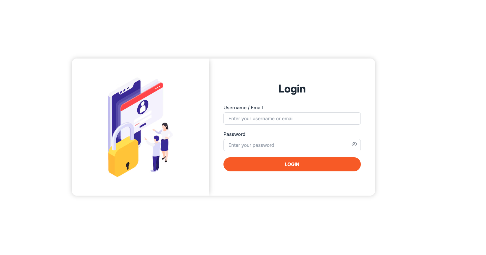

# 🧩 Inventory, Orders & User Management System

This project is a backend/admin panel for managing **products**, **orders**, and **users** while syncing data with popular ecommerce platforms like **Maropost** and **Shopify**.

It provides:

- Centralized **product management**
- **Order syncing** between ecommerce platforms and suppliers
- Basic **user management** (admin/operators/etc.)

---

## 🚀 Features

### 1. Products Management

- **Add Products**  
  Create products with details like name, SKU, price, stock, brand, etc.

- **Update Products**  
  Edit product details and sync changes with connected ecommerce platforms.

- **Delete Products**  
  Soft or hard delete products as per business rules.

- **Bulk Products Import (CSV)**  
  Upload CSV files to import multiple products at once with validation.

- **Bulk Products Export (CSV)**  
  Export all or filtered products into a CSV format.

- **Sync Products with Ecommerce Platforms (Maropost / Shopify)**  
  Push or pull product data between the system and platforms.

---

### 2. Order Management

- **Fetch Orders from Ecommerce Platforms**  
  Retrieve orders from Shopify/Maropost through APIs.

- **Add Orders to Suppliers**  
  Convert ecommerce orders into supplier orders.

- **Update Orders in Ecommerce Platforms**  
  Update order status, tracking numbers, and fulfillment details back to platforms.

---

### 3. User Management

- **Add Users**  
  Create admin or operator accounts.

- **Update Users**  
  Edit user information such as name, email, and role.

- **Delete Users**  
  Deactivate or delete user accounts.

## 🧪 Demo

### 🔐 Login Page


### 📊 Dashboard


### 📦 Products Page


### 📝 Orders Page


---

## 🔐 Demo Login Credentials

**URL:** https://erp.ganatrainfo.com  
**Email:** demo@example.com  
**Password:** Demo@123

## 🛠️ Tech Stack

- **Frontend:** React (JavaScript)  
- **Backend:** Laravel (PHP)  
- **Database:** MySQL  
- **Integrations:** Maropost, Shopify  
- **API Type:** REST  

---

## 📦 Getting Started

### 1. Clone the Repository

```bash
git clone https://github.com/hemang-gantrainfo/Ganatra-Info-ERP.git
cd Ganatra-Info-ERP


## 📁 Project Structure

Ganatra-Info-ERP/
 ├── frontend/        # React-based admin panel
 └── backend/         # Laravel-based API

cd backend
composer install
cp .env.example .env
php artisan key:generate

⚙️ Backend Setup (Laravel)

cd backend
composer install
cp .env.example .env
php artisan key:generate

## Update .env with your database and integration credentials:

APP_NAME="Inventory, Orders & User Management System"
APP_ENV=local
APP_DEBUG=true
APP_URL=http://localhost:8000

DB_HOST=127.0.0.1
DB_PORT=3306
DB_DATABASE=your_database
DB_USERNAME=your_username
DB_PASSWORD=your_password

# Maropost
MAROPOST_API_KEY=your_maropost_api_key
MAROPOST_BASE_URL=your_maropost_base_url

# Shopify
SHOPIFY_API_KEY=your_shopify_api_key
SHOPIFY_API_SECRET=your_shopify_api_secret
SHOPIFY_STORE_DOMAIN=yourshop.myshopify.com


Run migrations (and seed if required):

php artisan migrate
php artisan db:seed 

Start the Laravel development server:

php artisan serve

## Default URL Backend:
http://localhost:8000


🖥️ Frontend Setup (React)

cd frontend
npm install
# or
yarn install

Create .env in frontend:

REACT_APP_API_URL=http://localhost:8000/api
REACT_APP_ENV=development

Run the React development server:

npm start
# or
yarn start

## Default URL Frontend:
http://localhost:3000

Build production bundle:

npm run build
# or
yarn build
